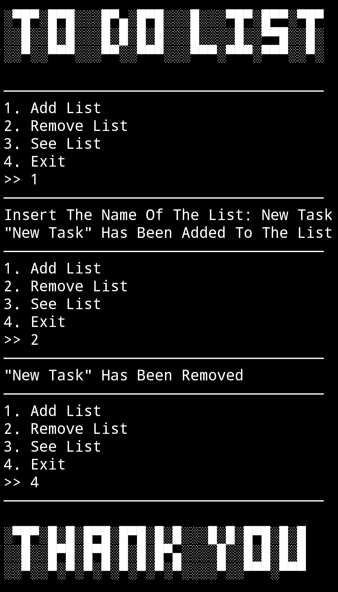

🟢 Todo List

**ZPP** (Zikri Practice Project) Series **VII**


[](https://github.com/zikri-codes/Todo-List-ZPP-VII/blob/main/LICENSE)


## 📌 Description
**Todo List** is a simple **Python-based CLI tool** that allows you to **add**, **remove**, and **view** your tasks in one place.  
It’s perfect for learning basic Python logic, input handling, and clean terminal interfaces.

## ✨ Features
- Add new tasks easily.  
- Remove tasks by selecting their index number.  
- View all tasks currently in your list.  
- Multiple keyword commands supported (e.g., `add`, `add list`, `1`, `remove`, `rmv`, `2`, etc).  
- ASCII-style opening and closing banners for a unique CLI vibe.

## 🚀 How to Run
1. **Clone** this repository:
    ```bash
    git clone https://github.com/zikri-codes/Todo-List-ZPP-VII.git
    cd Todo-List-ZPP-VII
    ```
2. Run the script using Python:
    ```bash
    python todo-list.py
    ```

## 📸 Screenshot



## 📁 Project Structure
```
. 
├── README.md           # Project description 
├── LICENSE             # MIT License 
├── todo-list.py        # Main Python script 
└── screenshot.jpg      # Program output example
```

## 📄 License
This project is licensed under the **MIT License** – see the [LICENSE](https://github.com/zikri-codes/Todo-List-ZPP-VII/blob/main/LICENSE) file for details.